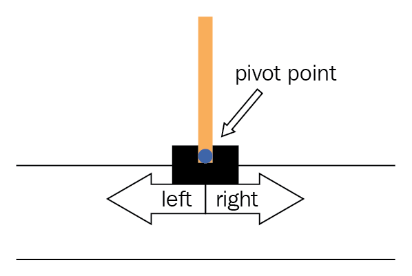

# Approaching CartPole-v1 with Reinforcement Learning

### Background

The purpose of this project is to practice my engineering skill. In order to concentrate myself more on the algorithmic/debugging side and less on the data side, I chose inverted pendulum problem which is simple in its nature but still pose enough of challenge to be a non-trivial for Deep-Reinforcement-Learning.

There are two versions of `CartPole`, namely the `v0` and `v1` versions. According to my best knowledge, the only difference between the two versions is their threshold of when a solution is satisfactory [[1]](https://stackoverflow.com/a/56926451). In my target version `CartPole-v1`, a solution is good if it achieves in average $475/500$ points over $100$ random initial states. A point is rewarded for each step the pendulum's angle is in the range $(-0.2095, 0.2095)$ rad and the pivot point's distance to center is in the range $[0, 2.4)$ [[2]](https://www.gymlibrary.dev/environments/classic_control/cart_pole/).  

<p align="center">

</p>

### Goals of the project

While there are opportunities in my curriculum to do practical ML projects, those projects come mostly with the most difficult parts done and the students had to fill in blank spaces. 

To consider this project to be a success, I aim to achieve a running pipeline where I wrote the whole code from scratch and learned to debug the architecture on the numerical layers. I should be able to identify gradient vanishing/exploding, choose model of right capacity and organize a project that is suitable for hyper-parameter optimization.

On the theoretical side, I also shall become more confident with the basic of policy learning that I might be able to explain the theory to a less experienced person.

### Related projects

Below are some other projects that provide performance baselines for my own implementation. Since some projects are of tutorial nature, this listing is not meant for performance comparison; I consider it a survey of methodology.

<table>
  <tr>
    <th>Link</th>
    <th>Method</th>
    <th>Performance</th>
  </tr>
  <tr>
    <td><a src="https://medium.com/analytics-vidhya/q-learning-is-the-most-basic-form-of-reinforcement-learning-which-doesnt-take-advantage-of-any-8944e02570c5">Solving Open AI’s CartPole Using Reinforcement Learning Part-1
</a></td>
    <td>Q-Learning</td>
    <td>Rewards 195 after 28,000 episodes.</td>
  </tr>
  <tr>
    <td><a src="https://pytorch.org/tutorials/intermediate/reinforcement_q_learning.html">PyTorch - Reinforcement Learning (DQN) Tutorial</a></td>
    <td>Deep-Q-Learning with one hidden layer consists of 128 neurons.</td>
    <td>Best rewards ~175 after ~350 episodes.</td>
  </tr>
  <tr>
    <td><a src="https://www.tensorflow.org/tutorials/reinforcement_learning/actor_critic">TensorFlow - Playing CartPole with the Actor-Critic method</a></td>
    <td>Actor-Critic with one hidden layer consists of 128 neurons.</td>
    <td>Best rewards 475 after 237 episodes.</td>
  </tr>
</table>

An episode is a round, beginning with a random initial state of the pendulum. The episode is over when the pendulum's state is outside of permitted range or when the score is over $200$ (`v0` version) or $500$ (`v1` version).

### Theory

Reinforcement Learning makes Markov assumption about the environment. In particular that knowing the current state $s_t$ makes the next state $s_{t+1}$ independent from every other past states
$$p(s_{t+1} \mid s_t,a_t,\dots,s_1) = p(s_{t+1} \mid s_t,a_t)$$
An agent interacts with the environment $s_t$ at time step $t$ by executing an action $a_t$. For learning to happens, a signal/reward $r_t$ has to come back from the environment. The reward is distributed as 
$$r_t \sim p(r_t \mid s_t, a_t)$$
The goal of reinforcement learning is to learn a policy $\pi$ which maps a state to an action. Since rewards and states are random variables, we can only maximize the expected rewards we hope to achieve by executing the best action we can do given any state of the environment.

Depending on the problem and the actual goal we have in our mind, we must make a trade-off between achieving small rewards now or staying patient to achieve a larger pay-out later. Intuitively, an pay-out's relevance decreases the further the moment of reward lies in the future. In dependence of the problem, we might want our ideal policy to maximize reward as fast as possible, like this inverted pendulum that I am trying to solve. Or we might want the model to work its way to the actual goal which might be far in the future, think of strategic games, while sacrificing small rewards on its way until then.


Formally we want to formulate the expected rewards we can get at state $s_t$ if we execute an action $a_t$ and then follow the policy $\pi$ in the future steps. To express our desire to achieve rewards faster, we rescale the rewards in the future by a geometric series and denote it as

$$Q^\pi(s_t, a_t) = \mathbb{E}[\sum_k \gamma^k r_{t + k} \mid s_t, a_t, \pi]$$

While the discount factor $\gamma$ can be tuned, if $\gamma < 1$ then its exponential nature make future rewards vanishing quickly. The optimal $\hat{Q}(s_t, a_t)$ given fixed $s_t, a_t$ can be achieved by learning the best policy. Suppose we know $\hat{Q}(s_t, a_t)$ for any $a_t$, then the best action can be determined with this $\hat{Q}$; and knowing the best possible action for the current state gives us the optimal policy. While this seems like a chicken egg problem, the next theoretical part will help us to resolve the circular dependency.


It's not hard to show that 

$$\hat{Q}(s_t, a_t) = \mathbb{E}[\sum_k \gamma^k r_{t + k} \mid s_t, a_t, \pi] = \mathbb{E}[r_t + \gamma \max_{a'} \hat{Q}(s_{t+1}, a')]$$

While the third expression, also known as the Bellman Optimality Equation, simplifies the the initial definition, we can still not learn a policy that maximizes the $Q$-value at state $s_t$, because we still need the $Q$-value at state $t+1$. Turn out, we can still learn $\hat{Q}$ iteratively by replace the optimal $\hat{Q}$ in the definition simply with the current learned $Q$ and the iterative scheme, also called $Q$-learning, will converge to $\hat{Q}$ when some very weak assumptions are met.

Now in the original format, $Q$-learning can be understood as learning a table consist of states rows $s_t$ and action columns $a$ with expected reward entries of $r_t \sim p(r_t \mid s_t, a_t)$. Deep-$Q$-learning replaces the explicit tables with a deep neural network parametrized by $\theta$ with the loss function w.r.t network's parameter $\theta$

$$\mathbb{E}_{s_t, a_t, r_t}[\mathcal{L}(r_t + \gamma \max_{a'} Q(s_{t+1}, a'; \theta), Q(s_t, a_t; \theta))]$$

where $\mathcal{L}$ is an arbitrary standard differentiable loss function in regression context. Here we can reduce the expected loss by empirical risk minimization.

### Method

The first obstacle was to decide how to pre-process input of the problem. For CNN, input's features have homogeneous ranges $[0, 255]$ and hence scaling was trivial. In my case, the cart position has range $[-4.8, 4.8]$ and the pole angle could be in range $[-0.418, 0.418]$ while the cart velocity and pole angular velocity do not have bounded ranges. After testing multiple ways to clip the velocities, I found it was for the best to leave the ranges unbounded and even unnormalized. While the experiments were not exhaustive, I got the model learning when leave everything as-is and that was good enough for my goal. 

Regarding the architecture, I opted for simple feed-forward network. Since the problem was easy in nature, I decided to start with an one-layer network. The final network, found with help of Bayesian Optimization at the time of writing, consists of two layers with $64$ and $32$ neurons, respectively. 

After a few experiments where the network failed to run and I was sure the problem was not in my code, I visualized the network's gradients, activations and weights' distribution. For the first time I encountered the problem of gradient exploding and realized this problem is not just theoretical. To mitigate gradient exploding, gradients were clipped to be between $-1$ and $1$.

For our problem, the rewarding continues as long as the pendulum stands. As soon as an episode is over, that is we reach a terminal state, the rewarding chain ended. Realizing this helped me to fix the worst bug in my implementation by adding a flag after a state ended

```python
# Buggy code
next_state_best_rewards = target_net(next_observation).max(dim=-1)[0]
state_action_expected_reward = reward + params["GAMMA"] * next_state_best_rewards
```

to break the reward chain.

```python
# Bug fixed
next_state_best_rewards = target_net(next_observation).max(dim=-1)[0] * (1 - terminated) # The reward series ends when we reach a terminal state 
state_action_expected_reward = reward + params["GAMMA"] * next_state_best_rewards
```

### Result

After getting the code run smoothly and the learned network showed first signs of balancing the pendulum successfully, I ran a Bayesian Optimization script on every hyperparameter and achieved an average score of $280$ on $100$ consecutive episodes. While this score is enough to be considered to solve `CartPole-v0`, I still need research for improvements to solve `CartPole-v1`.

### Conclusion

While `v1` is not solved, yet, I still consider this project a win for me since debugging a network gave me a run for my money. I now feel more confidence in my engineering skill and am ready for more challenging problems.

